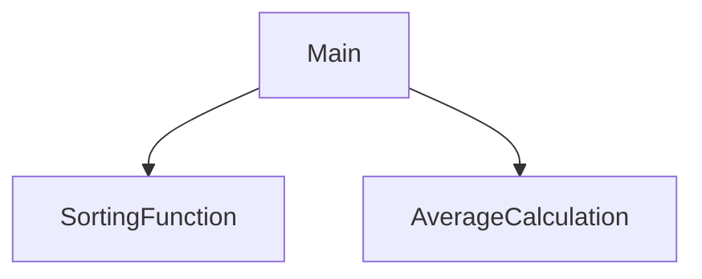

# Ch9_TeamChallenge
Abby and Jullian

## Test_Score_Analyzer Description
Here is where you describe what the program does

### Test_Score_Analyzer Flowchart

#### Function Diagrams

| `Main`    |               |  Jullian and Abby    |
| ------------------ | ------------- | ------------ |
| `argument:type`    | takes input from the user for ____  |              |
| `time:integer`     | calculates ______  | outputs ____             |
| `name:string`      | takes input for name ___ | returns total |
***
| `SortingFunction`    |               |     Abby   |
| ------------------ | ------------- | ------------ |
| `argument:type`    | takes input from the user for ____  |              |
| `time:integer`     | calculates ______  | outputs ____             |
| `name:string`      | takes input for name ___ | returns total |
***
| `AverageFunction`    |               |  Jullian     |
| ------------------ | ------------- | ------------ |
| `argument:type`    | takes input from the user for ____  |              |
| `time:integer`     | calculates ______  | outputs ____             |
| `name:string`      | takes input for name ___ | returns total |
***
